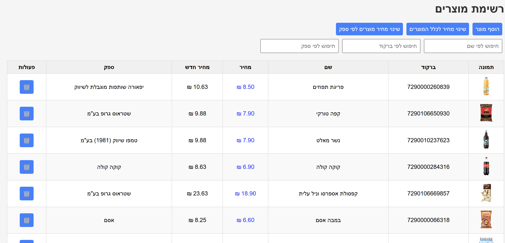

# Product Inventory Manager

A full-stack web application for managing a product inventory, including loading, searching, adding, updating, and deleting products.

## 🛠 Technologies Used

- **MongoDB + Mongoose** – for database storage
- **Express (Node.js)** – for building the server API
- **React** – for the user interface (via create-react-app)

## ⚙️ Running Locally

### 1. Run the server (Backend)

```
cd product-importer
npm install
node server.js
```

### 2. Run the client (Frontend)

```
cd frontend
npm install
npm start
```

Make sure your MongoDB server is running locally on `mongodb://localhost:27017/productDB`.

## 🚀 Features

- Search products by name, barcode or supplier
- Update prices for:
  - All products
  - All products of a specific supplier
  - Individual product (inline)
- Add and delete products
- Sorts products with images to the top
- RTL support (Hebrew interface)
- Tooltip for delete button
- All operations reflect immediately on the UI

## 📷 Screenshot



---

Built with 💙 by Roey Nir
